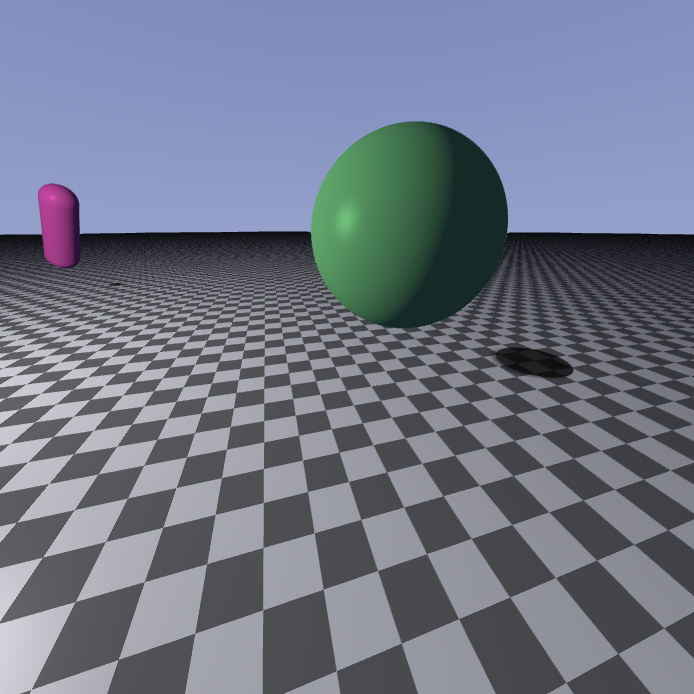

# **Photorealistic graphics in real time using the Ray Marching algorithm in a compute shader**

This is my Thesis project written in OpenGL. I'm creating a texture which I draw inside the compute shader and then I apply it on a full screen quad inside the fragment shader.<br>My implementation is based on [electricsquare](https://github.com/electricsquare/raymarching-workshop)'s workshop.

## Prerequisites
You'll need the g++ compiler and the GLFW library. I'm also using GLM but I've included it inside the folders. <br> <br>
For **DEBIAN** <br>
```sudo apt-get install libglfw3 libglfw3-dev g++``` <br> <br>
For **MANJARO** <br>
```sudo pacman -S g++ glfw-x11``` <br> <br>

Compile and run with the following command:<br>
```g++ main.cpp -lGL -lglfw && ./a.out``` <br> <br>

## Controls
* **WASD** moving around
* **UP/DOWN** arrows, increase and decrease number of reflections. (max is 5, you can change that)
* **F1** 4MSAA on/off
* **L** PolygoneMode on/off
* **ESC** close the window

# A few things I've implemented
## Movement


## Point light and light attenuation


## Soft shadows
**Hard versus soft shadows** <br>
 

## 4xMultisample anti-aliasing
**Anti-aliasing on/off** <br>
 

## Reflections


**If you want to get into Ray Marching I suggest checking [Inigo Quilez](https://www.iquilezles.org/www/index.htm)**.


